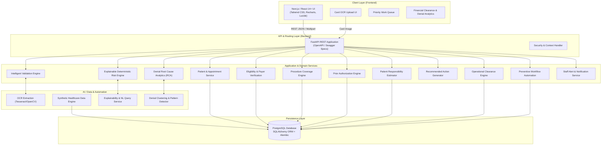
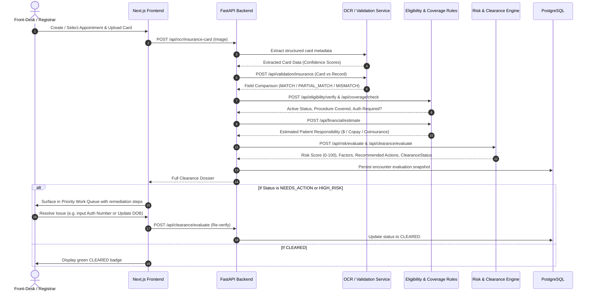
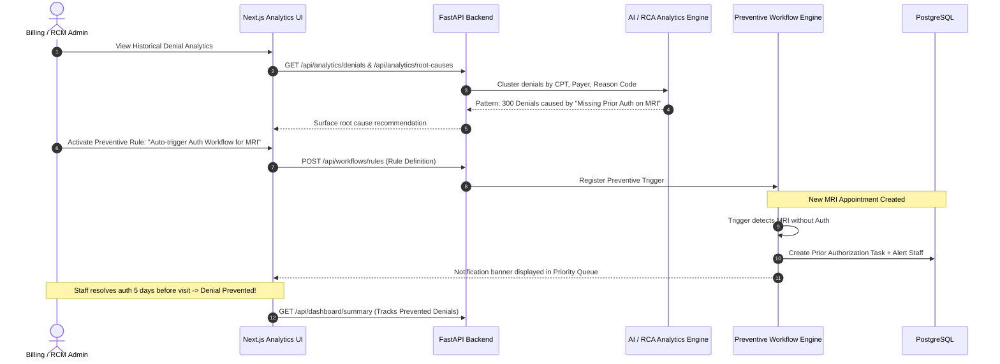
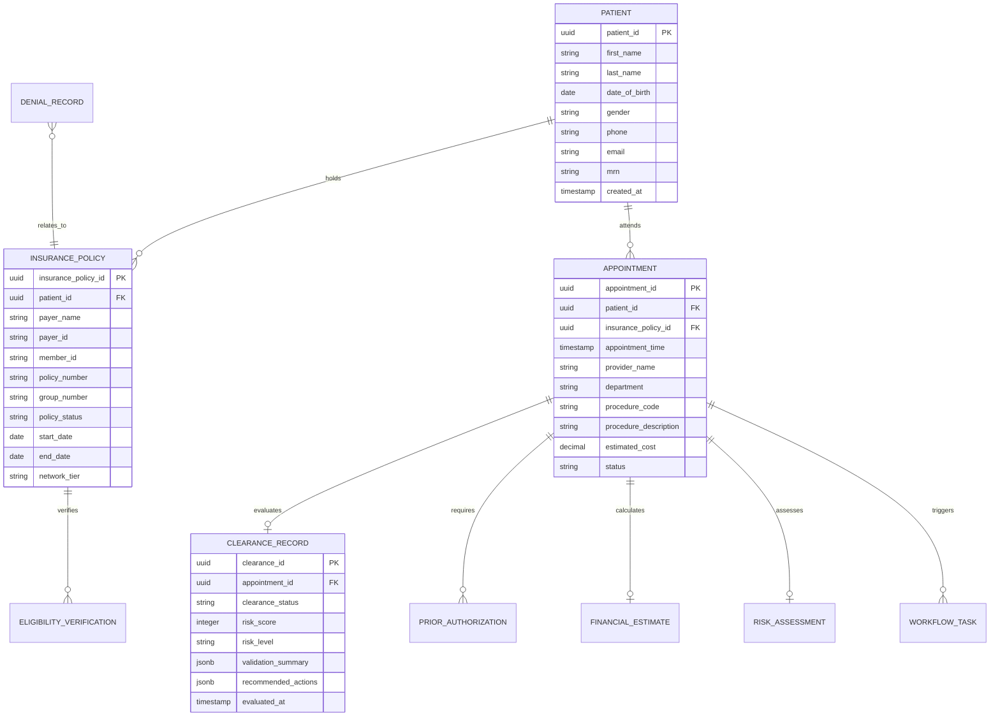

# Previa: Pre-Visit Financial Clearance (PVFC) - System Architecture

## 1. System Overview

**Previa** is an intelligent, pre-visit financial clearance platform designed to prevent healthcare claim denials before patient encounters take place. By validating patient demographics, verifying real-time payer eligibility, confirming procedure coverage, detecting prior-authorization mandates, and calculating patient financial responsibility prior to the appointment, Previa eliminates administrative bottlenecks and shifts revenue cycle management (RCM) from reactive claim rework to proactive prevention.

---

## 2. High-Level Architecture Diagram



---

## 3. Logical Domain Services

| Service Name | Primary Responsibilities |
| :--- | :--- |
| **Patient Service** | Manages patient demographic profiles, insurance records, and scheduled appointments. |
| **OCR & Data Extraction Pipeline** | Ingests front/back insurance card images, normalizes images (OpenCV), extracts text fields with confidence scores. |
| **Intelligent Validation Engine** | Compares OCR data against existing hospital EHR records, assigning field-level `MATCH`, `PARTIAL_MATCH`, or `MISMATCH`. |
| **Eligibility Verification Service** | Evaluates policy active dates, subscriber status, network tier, and payer eligibility response. |
| **Procedure Coverage Service** | Checks planned CPT/HCPCS procedure codes against the patient's payer benefit schedule and exclusions. |
| **Prior Authorization Engine** | Detects payer-specific prior authorization requirements for planned services and tracks authorization numbers/status. |
| **Financial Responsibility Estimator** | Calculates deductible remaining, copay, coinsurance percentage, and estimated out-of-pocket patient cost. |
| **Deterministic Risk Engine** | Computes a transparent 0–100 risk score based on weighted risk factors and builds an explainable breakdown. |
| **Clearance Engine** | Assigns operational status (`CLEARED`, `NEEDS_ACTION`, `HIGH_RISK`) according to deterministic safety rules. |
| **Recommendation Engine** | Maps detected validation, coverage, or authorization anomalies to concrete, prioritized staff remediation steps. |
| **Root Cause Analysis (RCA) Service** | Aggregates historical claim denials, identifies systemic patterns (e.g. payer-specific missing auth on MRIs), and calculates baseline denial rates. |
| **Workflow Automation Service** | Instantiates pre-visit tasks and rules when high-risk scenarios or recurring denial patterns are detected. |
| **Notification Service** | Alerts registrars and financial counselors of approaching appointments with unresolved blockers. |

---

## 4. End-to-End Workflows

### 4.1 Core Patient Financial Clearance Workflow



### 4.2 Systemic Prevention & Denial Root Cause Workflow



---

## 5. Deterministic Risk Engine Specification

The Risk Engine calculates a **0 to 100 integer score** representing the probability of an eligibility or claim denial.

### 5.1 Configurable Factor Weights

| Factor Identifier | Impact Weight | Severity Category | Description |
| :--- | :---: | :--- | :--- |
| `inactive_insurance` | **40** | CRITICAL | Insurance policy status is inactive or terminated. |
| `expired_policy` | **40** | CRITICAL | Policy expiry date precedes the planned encounter date. |
| `missing_authorization` | **30** | CRITICAL | Procedure requires prior authorization, but status is missing/unapproved. |
| `critical_member_id_mismatch` | **25** | CRITICAL | Member ID on card does not match hospital record. |
| `policy_number_mismatch` | **25** | CRITICAL | Policy/Group number on card differs from hospital record. |
| `dob_mismatch` | **25** | CRITICAL | Date of birth on card differs from hospital record. |
| `out_of_network` | **15** | HIGH | Provider or facility is out-of-network for the patient's plan. |
| `policy_expiring_soon` | **10** | MEDIUM | Policy expires within 30 days of appointment date. |
| `minor_name_mismatch` | **5** | LOW | Minor variation in patient name spelling or middle initial. |

### 5.2 Risk Calculation Formula

$$\text{Raw Score} = \sum_{i} \text{Factor Weight}_i$$
$$\text{Risk Score} = \min(100, \text{Raw Score})$$

### 5.3 Categorization Tiers
- **LOW Risk**: `0` – `39`
- **MEDIUM Risk**: `40` – `69`
- **HIGH Risk**: `70` – `100`

### 5.4 Explainability Output Structure
Every evaluation returns an array of contributing factors with human-readable rationale:
```json
{
  "risk_score": 78,
  "risk_level": "HIGH",
  "factors": [
    { "factor_code": "missing_authorization", "reason": "Prior authorization is required for MRI Brain but not on file", "impact": 30 },
    { "factor_code": "critical_member_id_mismatch", "reason": "Card Member ID (AB123456) differs from EHR (AB123465)", "impact": 25 },
    { "factor_code": "out_of_network", "reason": "Facility is Tier-2 / Out-of-Network for BlueCross Select", "impact": 15 },
    { "factor_code": "minor_name_mismatch", "reason": "Name variation: Rahul Sharma vs Rahul S.", "impact": 5 }
  ]
}
```

---

## 6. Operational Clearance Engine Logic

The Clearance Engine translates risk, validation, eligibility, and authorization states into a single operational directive:

```mermaid
flowchart TD
    Start([Evaluate Patient Encounter]) --> CheckCritical{Unresolved Critical Issue?<br/>- Inactive/Expired Insurance<br/>- Member ID Mismatch<br/>- Non-covered service<br/>- Denied Prior Auth}
    CheckCritical -- YES --> MarkHighRisk[Assign HIGH_RISK]
    CheckCritical -- NO --> CheckResolvable{Resolvable Blocker Present?<br/>- Missing Auth (pending creation)<br/>- Out of Network<br/>- Minor Name Mismatch<br/>- Expiring Soon}
    CheckResolvable -- YES --> MarkNeedsAction[Assign NEEDS_ACTION]
    CheckResolvable -- NO --> MarkCleared[Assign CLEARED]
```

### Safety Invariant
> **Invariant**: A patient MUST NEVER be assigned `CLEARED` if any critical blocker exists (e.g. inactive insurance, missing authorization for mandatory service, or unverified identity).

---

## 7. Canonical API Surface

All endpoints are prefixed with `/api`. Detailed JSON schemas reside in `contracts/`.

| Domain | Method | Endpoint | Description |
| :--- | :--- | :--- | :--- |
| **Patients** | `GET` | `/api/patients` | List patients with pagination and search. |
| | `GET` | `/api/patients/{patient_id}` | Fetch patient profile, demographic, and historical policies. |
| | `POST` | `/api/patients` | Register new synthetic patient record. |
| **Appointments** | `GET` | `/api/appointments` | List scheduled appointments with filter by date, provider, status. |
| | `GET` | `/api/appointments/{appointment_id}` | Retrieve appointment details, procedure codes, and clearance state. |
| | `POST` | `/api/appointments` | Schedule a new appointment. |
| **OCR** | `POST` | `/api/ocr/insurance-card` | Upload card image; returns structured extraction with confidence scores. |
| **Validation** | `POST` | `/api/validation/insurance` | Compare OCR extraction with hospital record; returns field-level statuses. |
| **Eligibility** | `POST` | `/api/eligibility/verify` | Query payer eligibility service for policy status, dates, and benefits. |
| **Coverage** | `POST` | `/api/coverage/check` | Check coverage and prior-auth necessity for specific CPT codes. |
| **Financial** | `POST` | `/api/financial/estimate` | Calculate patient out-of-pocket, copay, deductible, and coinsurance. |
| **Risk** | `POST` | `/api/risk/evaluate` | Evaluate 0-100 risk score and explainable contributing factors. |
| **Clearance** | `POST` | `/api/clearance/evaluate` | Execute full multi-point clearance evaluation. |
| | `GET` | `/api/clearance/{patient_id}` | Retrieve latest clearance state for a patient. |
| **Dashboard** | `GET` | `/api/dashboard/summary` | Aggregate metrics (total upcoming, cleared, high risk, financial exposure). |
| | `GET` | `/api/dashboard/priority` | Ranked priority queue of patients needing staff action. |
| | `GET` | `/api/dashboard/alerts` | Urgent alerts for upcoming appointments with critical blockers. |
| **Analytics & RCA** | `GET` | `/api/analytics/denials` | Historical denial patterns grouped by reason, procedure, payer. |
| | `GET` | `/api/analytics/root-causes` | Systemic root cause insights and recommended preventive rules. |
| **Workflows** | `POST` | `/api/workflows/authorization` | Trigger automated authorization request task. |
| | `GET` | `/api/workflows/pending` | Fetch list of active background remediation tasks. |

---

## 8. Database Architecture (PostgreSQL / SQLAlchemy)

The database schema utilizes relational integrity and foreign keys.


