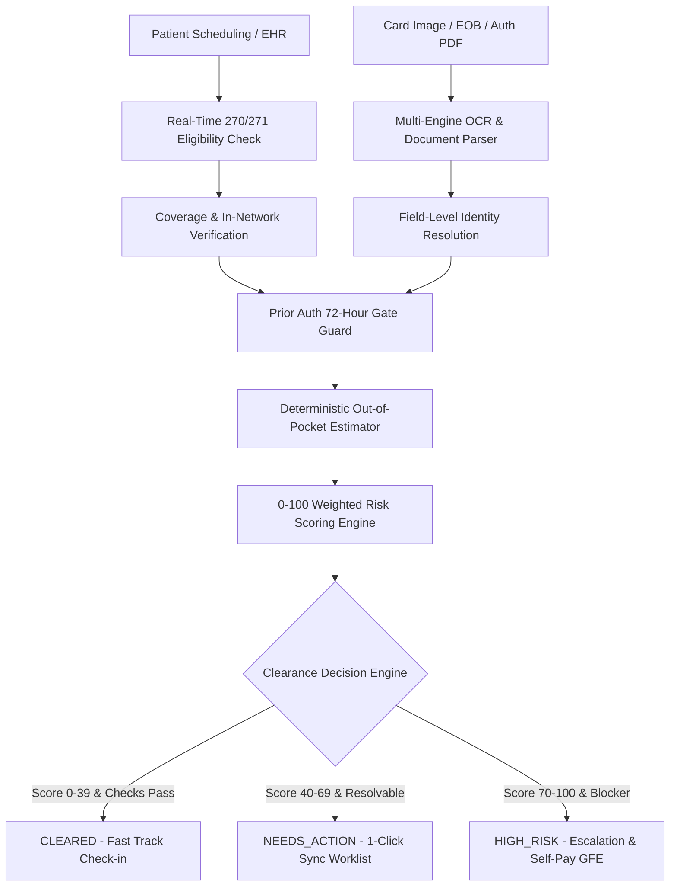
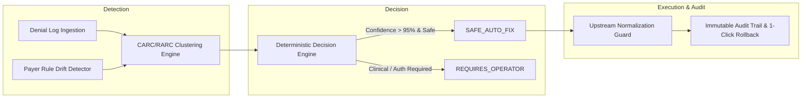

# Previa: Pre-Visit Financial Clearance & Self-Healing RCM Platform (PVFC)

<div align="center">

```
  ____   ____   _______      __ _____           
 |  _ \ |  _ \ | ____\ \    / /|_   _|   /\     
 | |_) || |_) ||  _|  \ \  / /   | |    /  \    
 |  __/ |  _ < | |___  \ \/ /   _| |_  / /\ \   
 |_|    |_| \_\|_____|  \__/   |_____|/_/  \_\  
```

### *Intelligent Healthcare Pre-Encounter Financial Clearance, Real-Time Eligibility Verification, OCR Extraction & Self-Healing Denial Prevention*

[](https://fastapi.tiangolo.com)
[](https://nextjs.org)
[](https://vitejs.dev)
[](https://www.postgresql.org)
[](#contracts-first-architecture)
[](LICENSE)

**[Live Backend API](https://previa-priz.onrender.com/api/v1/docs)** • **[Render Deployment Guide](docs/DEPLOYMENT_RENDER.md)** • **[Vercel Deployment Guide](docs/DEPLOYMENT_VERCEL.md)** • **[Architecture Specs](ARCHITECTURE.md)**

</div>

---

## 📑 Table of Contents

- [Executive Summary & Mission](#-executive-summary--mission)
- [Core Platform Capabilities](#-core-platform-capabilities)
- [System Architecture](#-system-architecture)
- [Self-Healing RCM & Denial Prevention Engine](#-self-healing-rcm--denial-prevention-engine)
- [Directory & Monorepo Structure](#-directory--monorepo-structure)
- [API Surface Catalog](#-api-surface-catalog)
- [Quickstart & Local Setup](#-quickstart--local-setup)
- [Deployment Guides (Render & Vercel)](#-deployment-guides)
- [Multi-Agent Coordination Protocol](#-multi-agent-coordination-protocol)
- [Synthetic Data & HIPAA Compliance](#-synthetic-data--hipaa-compliance)

---

## 🌟 Executive Summary & Mission

> **Core Philosophy**:  
> *"Do not wait for an eligibility problem to become a claim denial 45 days later. Detect, resolve, and prevent the problem before the patient visit."*

In traditional hospital revenue cycle management (RCM), **over 70% of claim denials** (e.g., CARC `CO-197` missing prior auth, `CO-27` terminated coverage, `CO-16` suffix mismatch) originate during pre-registration and patient intake. 

**Previa (PVFC)** shifts revenue protection completely upstream into the pre-service window:
1. **Verifies 270/271 real-time eligibility** and procedural coverage prior to encounter arrival.
2. **Extracts and validates insurance cards** using an OCR and layout analysis pipeline.
3. **Calculates patient financial responsibility** (copay, remaining deductible, coinsurance) deterministically.
4. **Applies an explainable 0–100 risk scoring engine** with root cause factor attribution.
5. **Classifies appointments into deterministic clearance states**: `CLEARED`, `NEEDS_ACTION`, or `HIGH_RISK`.
6. **Autonomously self-heals upstream errors** (name normalization, person code suffix auto-reconciliation, and payer rule drift detection).

---

## ⚡ Core Platform Capabilities



### 1. Real-Time Eligibility & Coverage Verification
- Simulates electronic EDI 270/271 inquiry streams against major commercial and government payers.
- Identifies policy status (`ACTIVE`, `INACTIVE`, `TERMINATED`), effective/expiration windows, and in-network provider tiers.
- Performs procedure-level CPT code coverage validation (e.g., MRI Lumbar Spine `72148`, Total Knee Arthroplasty `27447`, EGD Biopsy `43239`).

### 2. Multi-Engine Document OCR & Field Extraction
- Unified ingestion pipeline supporting **PyMuPDF (`fitz`)**, **Tesseract OCR**, and adaptive regular expression parsing.
- Extracts Member ID, Group Number, Payer Name, Copay amounts, Deductibles, and Prior Auth numbers with field-level confidence scores (0.00–1.00).
- Automatic person-code suffix extraction and variance reconciliation (e.g. `UHC-7712399-01` vs `UHC-7712399`).

### 3. Explainable Risk Scoring Engine (0–100)
- Fully transparent, deterministic weighted scoring model:
  $$\text{Risk Score} = \sum (\text{Factor Weight} \times \text{Severity})$$
- Provides human-readable factor breakdowns:
  - *Inactive Policy*: +50 points
  - *Missing Mandatory Prior Auth*: +40 points
  - *Member ID / Person-Code Suffix Mismatch*: +25 points
  - *Out-of-Network Provider*: +20 points
  - *Expiring in < 30 Days*: +10 points

### 4. Patient Financial Responsibility Estimator
- Computes mathematical breakdown before encounter:
  $$\text{Estimated Responsibility} = \text{Copay} + \min(\text{Remaining Deductible}, \text{Cost}) + (\text{Cost} - \text{Deductible}) \times \text{Coinsurance \%}$$
- Issues Good Faith Estimates (GFE) for self-pay and uninsured patients in compliance with No Surprises Act guidelines.

---

## 🛠 Self-Healing RCM & Denial Prevention Engine

Previa features a closed-loop **Self-Healing Denial Prevention Subsystem** designed to eliminate repetitive administrative denials before EDI 837 claim submission:



### Self-Healing Capabilities
- **Patient Name & Identity Normalization (`ERR-ID-NORM`)**: Auto-formats EHR legal names into payer EDI abbreviation standards without mutating canonical patient records.
- **Member ID Suffix Auto-Sync (`RULE-MEMBER-ID-SUFFIX-SYNC`)**: Captures trailing family person codes from card OCR and pushes updates to the pre-service stream.
- **Payer Rule Drift Detection (`ERR-MOD-DRIFT`)**: Flags sudden payer policy modifications (e.g., mandatory Modifier 25 on same-day E/M services) and updates pre-submission guards.
- **Audit Logging with 1-Click Rollback**: Every auto-correction records original value, corrected value, rule ID, and cryptographic verification hash with instant rollback capability.

---

## 📁 Directory & Monorepo Structure

```
Previa/
├── backend/                  # FastAPI REST API Backend
│   ├── app/
│   │   ├── api/v1/           # REST endpoints (Clearance, Claims, OCR, Rules, Self-Heal)
│   │   ├── core/             # App settings, CORS, and security configuration
│   │   ├── db/               # SQLAlchemy models, session factory, and synthetic seeders
│   │   ├── models/           # DB entities (Patient, Claim, Policy, Document, Denial)
│   │   ├── schemas/          # Pydantic validation schemas
│   │   └── services/         # Clearance Engine, OCR Pipeline, Risk Engine, Self-Healing
│   ├── requirements.txt      # Backend Python dependencies
│   └── render.yaml           # Backend Render deployment blueprint
├── frontend/                 # Next.js 16 (App Router) & Vite 6 SPA Frontend
│   ├── app/                  # Next.js page routes & layout
│   ├── components/           # Claims Workspace, Clearance Dashboard, Priority Queues
│   ├── lib/                  # API client, TypeScript definitions, and utility helpers
│   ├── src/                  # Vite TypeScript SPA components, services, and styles
│   ├── package.json          # Frontend scripts and UI dependencies
│   ├── vite.config.ts        # Vite configuration with React plugin & path aliases
│   ├── vercel.json           # Frontend Vercel routing configuration
│   └── render.yaml           # Frontend Render static site blueprint
├── contracts/                # Canonical Source of Truth (13 JSON Schemas)
│   ├── api_spec.json         # OpenAPI 3.1.0 Contract
│   ├── clearance.schema.json # Clearance status and risk scoring schema
│   ├── eligibility.schema.json
│   ├── insurance.schema.json
│   └── workflow.schema.json
├── data/                     # Synthetic test PDFs, EOB samples, and OCR fixtures
├── docs/                     # Architecture Decision Records (ADRs) & Deployment guides
│   ├── DEPLOYMENT_RENDER.md  # Step-by-step Render setup
│   └── DEPLOYMENT_VERCEL.md  # Step-by-step Vercel setup
├── scripts/                  # Contract validation & utility scripts
├── AGENTS.md                 # Multi-Agent Coordination Protocol
├── ARCHITECTURE.md           # Deep Architectural Design Document
├── docker-compose.yml        # Multi-container local orchestration
├── render.yaml               # Root Render full-stack blueprint
└── vercel.json               # Root Vercel monorepo configuration
```

---

## 📡 API Surface Catalog

All endpoints are versioned under `/api/v1` and documented via interactive OpenAPI/Swagger:

| Method | Endpoint | Description |
| :--- | :--- | :--- |
| `GET` | `/health` | Service health status and gateway availability |
| `GET` | `/api/v1/clearance/summary` | Aggregate clearance metrics (`CLEARED`, `NEEDS_ACTION`, `HIGH_RISK`) |
| `GET` | `/api/v1/clearance/queue` | Prioritized pre-visit patient clearance worklist |
| `POST` | `/api/v1/eligibility/verify` | Real-time 270/271 insurance eligibility inquiry |
| `POST` | `/api/v1/ocr/upload-card` | Insurance card & EOB document upload with multi-engine OCR |
| `GET` | `/api/v1/claims` | List and filter active hospital claims |
| `POST` | `/api/v1/claims/analyze` | AI denial likelihood prediction and factor breakdown |
| `GET` | `/api/v1/self-heal/overview` | Self-healing problem clusters, revenue impact, and resolution metrics |
| `POST` | `/api/v1/self-heal/pre-submission-guard` | Pre-submission claim inspection and automated healing gate |
| `POST` | `/api/v1/self-heal/audit-events/{id}/rollback` | 1-Click rollback of automated self-heal actions |
| `GET` | `/api/v1/rules/preventive` | Active preventive automation rules and prevention counters |

Interactive Swagger documentation is available at **`http://localhost:8000/api/v1/docs`** (local) or **`https://previa-priz.onrender.com/api/v1/docs`** (production).

---

## 🚀 Quickstart & Local Setup

### Prerequisites
- **Python 3.11+**
- **Node.js 20+** & **npm**
- *(Optional)* **Docker & Docker Compose**

### Option A: Local Development (Fastest)

#### 1. Clone Repository & Install Root Dependencies
```bash
git clone https://github.com/Shloke-101/Previa.git
cd Previa
```

#### 2. Validate Contract Schemas
```bash
python scripts/validate_contracts.py
```

#### 3. Start Backend (FastAPI)
```bash
cd backend
python -m venv venv
# Windows:
.\venv\Scripts\activate
# Linux/macOS:
source venv/bin/activate

pip install -r requirements.txt
uvicorn app.main:app --reload --port 8000
```

#### 4. Start Frontend (Next.js / Vite)
In a separate terminal:
```bash
# From workspace root:
npm run dev        # Next.js App (http://localhost:3000)
# or
npm run dev:vite   # Vite SPA Mode (http://localhost:3000)
```

---

### Option B: Run with Docker Compose
```bash
docker compose up --build
```
- **Frontend Dashboard**: `http://localhost:3000`
- **Backend API**: `http://localhost:8000`
- **PostgreSQL**: `localhost:5432`

---

## ☁️ Deployment Guides

### 1. Render Deployment (Full Stack + Database)
The repository includes a comprehensive [`render.yaml`](render.yaml) Blueprint:
1. Log in to [Render](https://dashboard.render.com) &rarr; **New +** &rarr; **Blueprint**.
2. Select the **`Previa`** repository.
3. Render automatically provisions:
   - **`previa-backend`**: FastAPI Web Service (Python 3.11)
   - **`previa-frontend`**: Vite / Next.js Static Site CDN
   - **`previa-postgres`**: PostgreSQL 15 Database
4. See [`docs/DEPLOYMENT_RENDER.md`](docs/DEPLOYMENT_RENDER.md) for full instructions.

### 2. Vercel Deployment (Frontend)
1. Import repository into [Vercel](https://vercel.com/new).
2. Set **Root Directory** to `frontend`.
3. Add Environment Variable `NEXT_PUBLIC_API_URL` = `https://previa-priz.onrender.com`.
4. Click **Deploy**. See [`docs/DEPLOYMENT_VERCEL.md`](docs/DEPLOYMENT_VERCEL.md).

---

## 🤝 Multi-Agent Coordination Protocol

This repository is maintained following a **Contract-First Protocol** documented in [`AGENTS.md`](AGENTS.md):

| Domain | Owner | Scope |
| :--- | :--- | :--- |
| **Backend & DB** | Agent 1 | FastAPI, SQLAlchemy, PostgreSQL, Verification APIs |
| **Frontend UI** | Agent 2 | Next.js 16, Vite, Tailwind CSS, Priority Queues, Patient Dossiers |
| **AI / Data & Automation** | Agent 3 | OCR Extraction, Error Clustering, Self-Healing, RCA Engine |
| **Shared Core** | Shared | `contracts/*.schema.json`, `tests/`, `docs/`, `scripts/` |

> **Anti-Drift Policy**: Any modifications to data models or API payloads must first be approved in `contracts/*.schema.json` and validated via `python scripts/validate_contracts.py` before code implementation.

---

## 🔒 Synthetic Data & HIPAA Compliance

- **Zero Real PHI**: All patient names, policy IDs, member numbers, addresses, and clinical encounter notes are 100% synthetic mock data generated for demonstration and research.
- **Deterministic AI Boundary**: LLMs are used exclusively for natural-language summaries and operator explanations. Clearance determinations, eligibility states, and financial math are strictly executed by deterministic rule engines.

---

<div align="center">
  <b>Built for Healthcare Revenue Cycle Innovation</b><br>
  Previa — Pre-Visit Financial Clearance System
</div>
