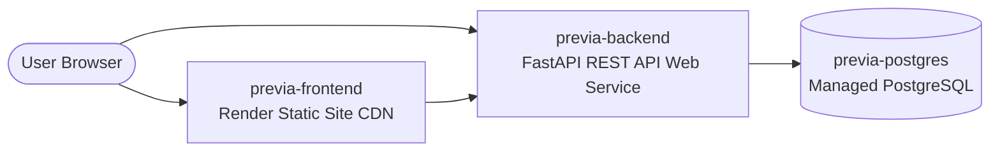

# Deploying Previa on Render

This guide outlines how to deploy the full **Previa (Pre-Visit Financial Clearance System)** stack to [Render](https://render.com) with the frontend deployed as a **Static Site** and the backend as a **Web Service** with managed **PostgreSQL**.

---

## Architecture on Render

The stack defined in [`render.yaml`](file:///render.yaml):
1. **`previa-frontend`**: Render **Static Site** (Vite SPA compiled to `dist/`, served globally via CDN with SPA rewrite routes).
2. **`previa-backend`**: Render **Web Service** (FastAPI, Python 3.11+, Uvicorn).
3. **`previa-postgres`**: Render **Managed Database** (PostgreSQL 15).

---

## 1-Click Deploy via Render Blueprint

1. **Push your code** to GitHub or GitLab.
2. In the [Render Dashboard](https://dashboard.render.com), click **New +** &rarr; **Blueprint**.
3. Select your **`Previa`** repository.
4. Render detects [`render.yaml`](file:///render.yaml) and automatically provisions:
   - PostgreSQL Database (`pvfc_db`)
   - Backend API Service (`previa-backend`)
   - Frontend Static Site (`previa-frontend`)
5. Click **Apply**.

---

## Service Configurations

### 1. Frontend Static Site (`previa-frontend`)
- **Type**: `static_site` (Static Site)
- **Root Directory**: `frontend`
- **Build Command**: `npm install && npm run build:vite`
- **Publish Directory**: `dist`
- **SPA Rewrites**: `/*` &rarr; `/index.html`
- **Environment Variables**:
  - `VITE_API_URL`: Backend API URL (e.g. `https://previa-backend.onrender.com`)

### 2. Backend Web Service (`previa-backend`)
- **Type**: `web`
- **Runtime**: Python 3.11.9
- **Root Directory**: `backend`
- **Build Command**: `pip install --upgrade pip && pip install -r requirements.txt`
- **Start Command**: `uvicorn app.main:app --host 0.0.0.0 --port $PORT`
- **Health Check**: `/health`
- **Environment Variables**:
  - `DATABASE_URL`: Linked from `previa-postgres`
  - `ENVIRONMENT`: `production`
  - `SECRET_KEY`: Auto-generated
  - `CORS_ORIGINS`: `*`
