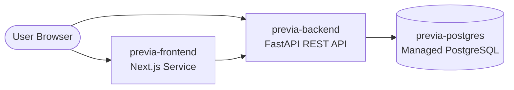

# Deploying Previa on Render

This guide outlines how to deploy the full **Previa (Pre-Visit Financial Clearance System)** stack to [Render](https://render.com) using the included `render.yaml` Blueprint (Infrastructure as Code) or via manual service creation.

---

## Architecture Overview on Render



The stack deployed by `render.yaml` includes:
1. **`previa-backend`**: FastAPI Web Service (Python 3.11+, Uvicorn, SQLAlchemy).
2. **`previa-frontend`**: Next.js 16+ Web Service (React 19, Tailwind CSS, App Router).
3. **`previa-postgres`**: Managed PostgreSQL Database (v15).

---

## Quick Deploy (Render Blueprint / 1-Click Sync)

1. **Push your repository** to GitHub / GitLab.
2. Log in to your [Render Dashboard](https://dashboard.render.com).
3. Click **New +** in the top navigation and select **Blueprint**.
4. Connect your GitHub/GitLab account and select the **`Previa`** repository.
5. Render will automatically detect [`render.yaml`](file:///render.yaml) and configure:
   - `previa-backend` (Python Web Service)
   - `previa-frontend` (Node Web Service)
   - `previa-postgres` (PostgreSQL Database)
6. Click **Apply**. Render will provision the database and build/deploy both services.

---

## Service Configurations & Environment Variables

### 1. Backend (`previa-backend`)
- **Runtime**: Python 3.11.9
- **Root Directory**: `backend`
- **Build Command**: `pip install --upgrade pip && pip install -r requirements.txt`
- **Start Command**: `uvicorn app.main:app --host 0.0.0.0 --port $PORT`
- **Health Check Path**: `/health`
- **Environment Variables**:
  | Variable | Value / Source | Description |
  | :--- | :--- | :--- |
  | `ENVIRONMENT` | `production` | Enables production mode |
  | `SECRET_KEY` | *(Auto-generated by Render)* | JWT / Session encryption secret |
  | `DATABASE_URL` | From `previa-postgres` connection string | Auto-linked PostgreSQL database |
  | `CORS_ORIGINS` | `*` (or your frontend domain) | Allowed cross-origin domains |

### 2. Frontend (`previa-frontend`)
- **Runtime**: Node 20.x
- **Root Directory**: `frontend`
- **Build Command**: `npm install && npm run build`
- **Start Command**: `npm run start`
- **Health Check Path**: `/`
- **Environment Variables**:
  | Variable | Value / Source | Description |
  | :--- | :--- | :--- |
  | `NEXT_PUBLIC_API_URL` | `https://previa-backend.onrender.com` (or auto-linked backend host) | Base URL for FastAPI backend |

---

## Manual Service Setup (Alternative to Blueprint)

If you prefer to configure services manually without Blueprints:

### Step 1: Create Database
1. Go to **New +** -> **PostgreSQL**.
2. Name: `previa-postgres`, Database: `pvfc_db`, User: `pvfc_admin`.
3. Choose the Free or Starter plan and create the database.
4. Copy the **Internal Database URL**.

### Step 2: Create Backend Service
1. Go to **New +** -> **Web Service**.
2. Select your repository.
3. Root Directory: `backend`.
4. Runtime: **Python 3**.
5. Build Command: `pip install --upgrade pip && pip install -r requirements.txt`.
6. Start Command: `uvicorn app.main:app --host 0.0.0.0 --port $PORT`.
7. Add Environment Variables:
   - `DATABASE_URL` = `<Internal Database URL from Step 1>`
   - `ENVIRONMENT` = `production`
   - `SECRET_KEY` = `<Random 32+ character string>`
   - `CORS_ORIGINS` = `*`
8. Deploy and copy your backend URL (e.g., `https://previa-backend.onrender.com`).

### Step 3: Create Frontend Service
1. Go to **New +** -> **Web Service**.
2. Select your repository.
3. Root Directory: `frontend`.
4. Runtime: **Node**.
5. Build Command: `npm install && npm run build`.
6. Start Command: `npm run start`.
7. Add Environment Variable:
   - `NEXT_PUBLIC_API_URL` = `https://<your-backend-subdomain>.onrender.com`
8. Deploy the frontend service.

---

## Verifying Deployment

1. **Backend Health Check**:
   Open `https://<your-backend-subdomain>.onrender.com/health` in your browser. Expected response:
   ```json
   {
     "status": "healthy",
     "service": "previa-backend",
     "gateway_270_271": "active"
   }
   ```
2. **Interactive API Docs (Swagger)**:
   Visit `https://<your-backend-subdomain>.onrender.com/api/v1/docs`.
3. **Frontend Application**:
   Visit `https://<your-frontend-subdomain>.onrender.com` to explore the Previa workspace, eligibility verifications, OCR scanning, and denial prevention dashboards.
